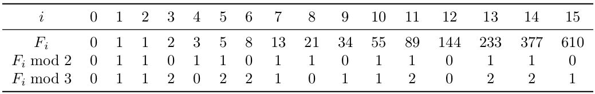

# Fibonacci Number Again

## Problem Introduction

In this problem, your goal is to compute 𝐹(𝑛) modulo 𝑚, where 𝑛 may be really huge: up to 10^14.

For such values of 𝑛, an algorithm looping for 𝑛 iterations will not fit into one second for sure. 

Therefore we need to avoid such a loop.

To get an idea how to solve this problem without going through all 𝐹(𝑖) for 𝑖 from 0 to 𝑛, let’s see what happens when 𝑚 is small — say, 𝑚 = 2 or 𝑚 = 3.

Take a detailed look at this table. Do you see? Both these sequences are periodic! 

For 𝑚 = 2, the period is 011 and has length 3, while for 𝑚 = 3 the period is 01120221 and has length 8. 

Therefore, to compute, say, 𝐹(2015) mod 3 we just need to find the remainder of 2015 when divided by 8. Since 2015 = 251 * 8 + 7, we
conclude that 𝐹(2015) mod 3 = 𝐹(7) mod 3 = 1.

This is true in general: for any integer 𝑚 ≥ 2, the sequence 𝐹(𝑛) mod 𝑚 is periodic. 

The period always starts with 01 and is known as Pisano period.

## Problem Description

**Task:** Given two integers 𝑛 and 𝑚, output 𝐹 𝑛 mod 𝑚 (that is, the remainder of 𝐹 𝑛 when divided by 𝑚).

**Input Format:** The input consists of two integers 𝑛 and 𝑚 given on the same line (separated by a space).

**Constraints:** 1 ≤ 𝑛 ≤ 10^14, 2 ≤ 𝑚 ≤ 10^3

**Output Format:** Output 𝐹(𝑛) mod 𝑚
